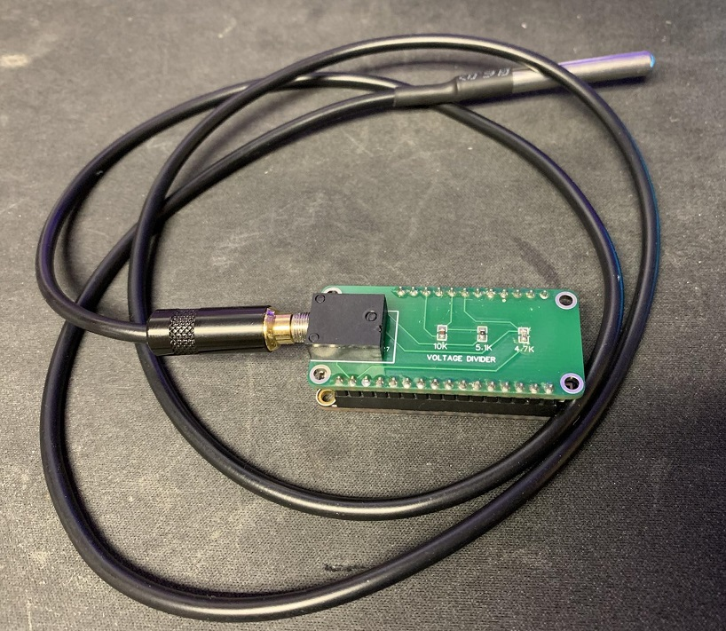
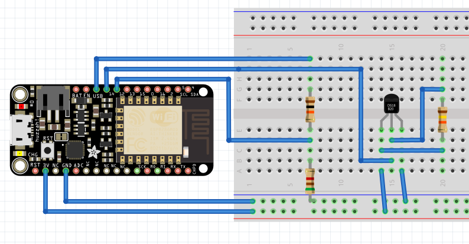
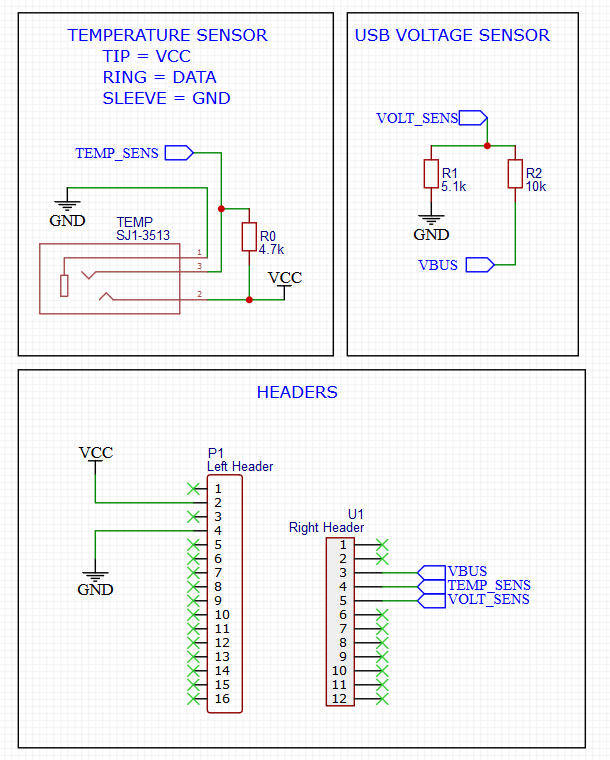
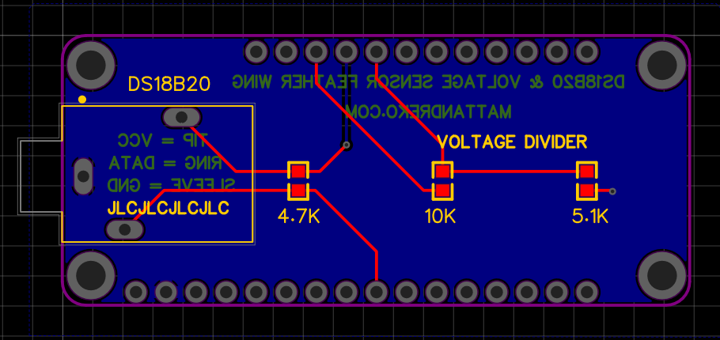
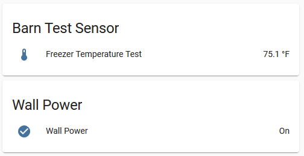

## Adafruit Feather Huzzah 8266 DS18B20 & Voltage Binary Sensor Wing

Simple Feather Wing to measure temperature from a DS18B20 probe and also report wall power status.

## License

 This work is licensed under a <a rel="license" href="http://creativecommons.org/licenses/by-sa/4.0/">Creative Commons Attribution-ShareAlike 4.0 International License</a>.

## Parts needed

- 1 x Adafruit Feather Huzzah 8266
- 1 x 10kΩ resistor
- 1 x 4.7kΩ resistor
- 1 x 5.1kΩ resistor
- 1 x SJ1-3513 headphone jack
- 1 x stacking headers kit (both male and female)
- 1 x headphone connector for DS18B20 probe
- 1 x [DS18B20 probe](https://smile.amazon.com/dp/B07MB1J43W/)

You can pick all the items up (except the probe) via this Octopart BOM: [https://octopart.com/bom-tool/DQqjCsNF](https://octopart.com/bom-tool/DQqjCsNF). The probe was way cheaper on Amazon or eBay for some reason. 

## Description

On multiple occasions, my barn freezer had turned off, losing all the food inside. Looking around, I could only find WiFi sensors which cost $200+ which blew my mind. I figured I could do it for less, and this was the result.

Adafruit Feathers support LiPo batteries, which give the chips the ability of staying on if power is lost from the wall. With the built-in charging circuit, you can run it from a 5v wall plug, and it'll charge the LiPo, acting similarly to a UPS. There were many projects out there to monitor the voltage of a battery, but not as many to monitor whether or not the 5v USB plug was being powered. Additionally, the Feather provides WiFi capability to add it to my home network with HomeAssistant/ESPHome.

This circuit consists of two parts:
 
1. A voltage divider consisting of 10kΩ and 5.1kΩ resistors. This will get the voltage from the 5V USB Pin down to safe levels for the GPIO pin. (3.3V max)
 
2. A DS18B20 temperature probe to monitor temperature of the inside of a freezer, without having the circuit inside.

While designing this circuit, I referred to the [Adafruit Feather Huzzah ESP8266 pinout](https://learn.adafruit.com/adafruit-feather-huzzah-esp8266/pinouts/) document often. Originally, I had assumed that the VBUS would be 0V when the 5V USB plug was removed, however it still receives power from the LiPo battery. So you can watch for 3-4V versus 5V to identify if the board is on battery or wall power. With a digital GPIO pin, it reads either HIGH or LOW, so we needed to convert it so that 3-4V was LOW and 5V was HIGH. After some testing with a potentiometer, it seemed like the threshold for that decision was roughly 1.6V on the GPIO pin. I used a [voltage divider calculator](https://ohmslawcalculator.com/voltage-divider-calculator) to get a rough estimate of the resistors I would need to use.
 
## Schematic

I originally had this on a breadboard, with the DS18B20 wires soldered directly to the ESP8266, which was less easy to play with. It essentially looked like this ([Fritzing file](fritzing_breadboard.fzz)):

To make it easier, to assemble and to look more professional when I shared it with others, I decided to use a custom PCB that anyone could order. Being a fairly new PCB designer, I used EasyEDA to design my circuit.

## PCB

I've included the [Gerber files](gerber.zip) if you want to order your own PCB from [JLCPCB](https://jlcpcb.com/) or somewhere else.

## HomeAssistant Example

I've included an [example](esphome.yaml) of how I setup the Adafruit Feather Huzzah ESP8266

## 3D Printed Case

TODO: Make a custom case based on this amazing Adafruit case: https://www.thingiverse.com/thing:2209964
